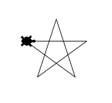

# Turtle の教科書


## Turtleって？
Pythonで簡単な図形描画ができるライブラリ。亀を模したペンをPythonのプログラムで操作して線を描く。


## 亀を表示させる
star.py という名前のソースコードを作成する。
star.py には以下のように書く。なお、# 以降の1行は、プログラムのソースコードとして認識されない。これを**コメント**という。

```
from turtle import *

turtle = Turtle()

# これがないと、ウィンドウがすぐ閉じてしまう。
raw_input("input any key > ")

```

実行する際には、コマンドで以下のように書く。

```
python star.py
```


ただし、このままだと亀(Turtle)が表示されない。ペンを亀の表示に変更するには、shape関数を呼び出す。

```
from turtle import *

turtle = Turtle()
turtle.shape("turtle")

# これがないと、ウィンドウがすぐ閉じてしまう。
raw_input("input any key > ")

```


## 線を引いてみる
forward関数を呼び出すことで、亀を前方に動かし、線を引くことができる。引数には、線のピクセル数を指定する。

```
from turtle import *

turtle = Turtle()
turtle.shape("turtle")

turtle.forward(100)

raw_input("input any key > ")

```

right関数、もしくはleft関数を呼び出すことで、亀の角度を変更することができる。引数には角度を入れる。

```
from turtle import *

turtle = Turtle()
turtle.shape("turtle")

turtle.forward(100)
turtle.right(45)
turtle.forward(100)

raw_input("input any key > ")

```


## 処理を繰り返す
for文というものを使うことで、処理を繰り返すことができる。

```
from turtle import *

turtle = Turtle()
turtle.shape("turtle")

for i in range(3):
	turtle.forward(100)
	turtle.right(45)

raw_input("input any key > ")
```

range(3) のように書くことで、3回処理が繰り返される。ここで、繰り返す対象の処理は、for文の下にTabで空白を入れて字を下げる**インデント**を行う必要がある。Pythonでは、インデントで文の入れ子構造を表現する。


## Mission1. 星を描く
以上の知識を使って、以下のように星型の図形を描きなさい。




## 再帰処理でコッホ曲線を描く

全体と部分が似通った形をしている図形のことを、フラクタルと呼ぶ。フラクタルな図形は、樹木や海岸線、巻貝など、自然界に多く存在する。

フラクタルな図形は、再帰と呼ばれる繰り返しの処理で、プログラムで簡潔に記述することができる。以下のkochは、コッホ曲線を再帰的に描くための関数である。

```
from turtle import *

def koch(turtle, size, depth=0):
	if depth <= 0:
		turtle.forward(size)
	else:
		koch(turtle, size/3, depth-1)
		turtle.left(60)     
		koch(turtle, size/3, depth-1)
		turtle.left(-120)   
		koch(turtle, size/3, depth-1)
		turtle.left(60)
		koch(turtle, size/3, depth-1)

turtle = Turtle()
turtle.shape("turtle")

koch(turtle, 200, 1)

raw_input("input any key > ")

```

このように、koch関数の中で、koch関数が同様に呼び出されることで、繰り返しが実現できる。

また、```koch(turtle, 200, 1)```のように呼び出すことで、( 200 / 3 ) ピクセルの直線を用いて、深さが1のコッホ曲線を描くことができる。深さが2、3と増えていくにつれて、曲線がどのような形になるかを確認しなさい。


## Mission2. コッホ曲線を六角形状に並べてみる
このコッホ曲線を六角形状に並べることによって、どのような図形を描くことができるかを考え、実際に描いてみなさい。

<!--答えは雪の結晶-->


